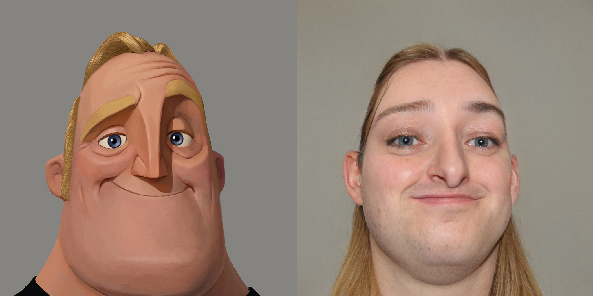
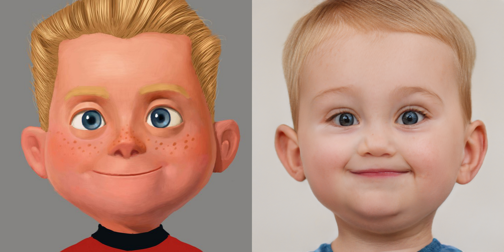
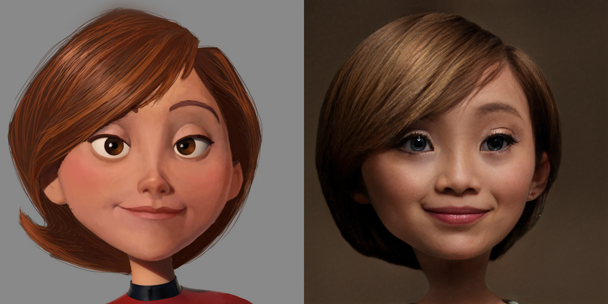
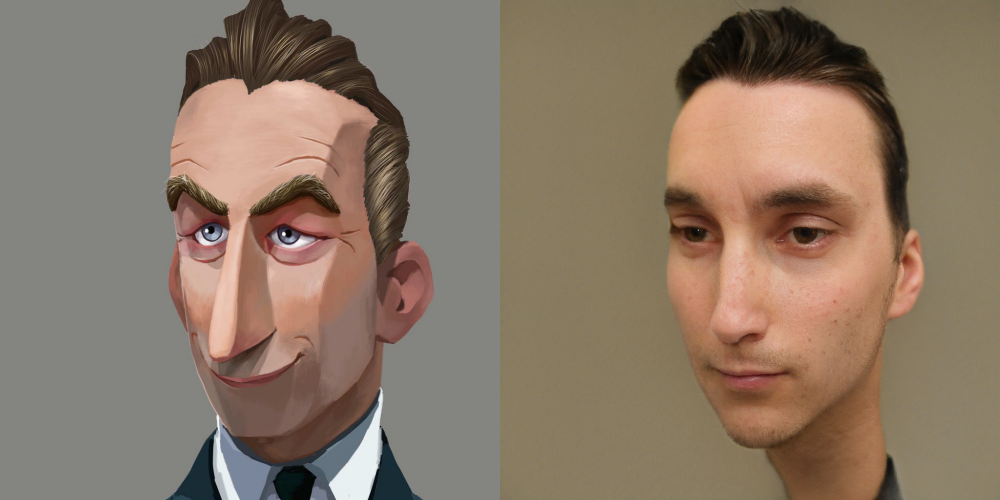
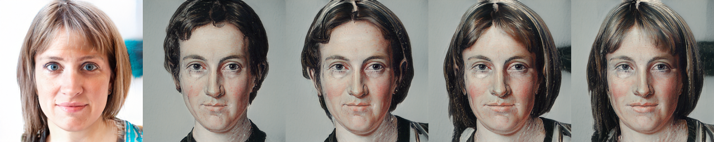
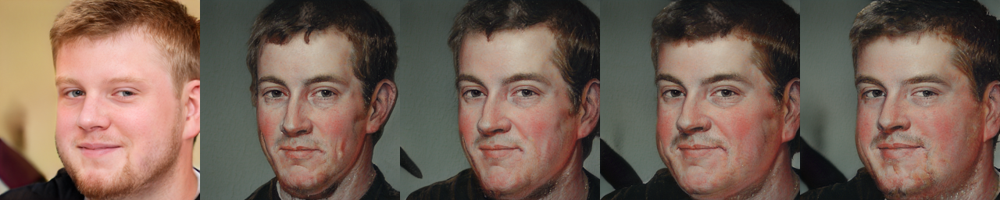

We proposed an unsupervised image-to-image translation method via pre-trained StyleGAN2 network. 

paper: [Unsupervised Image-to-Image Translation via Pre-trained StyleGAN2 Network](https://arxiv.org/abs/2010.05713)

### Prerequisite
* PyTorch 1.3.1
* CUDA 10.1

### Step 1: Model Fine-tuning
To obtain the target model, you need to follow the instruction of data preparation stated in the StyleGAN2 pytorch implementation [here](ub.com/rosinality/stylegan2-pytorch) 

``python prepare_data.py --out LMDB_PATH --n_worker N_WORKER --size SIZE1,SIZE2,SIZE3,... DATASET_PATH``

And fine-tune the model with data in the target domain:

``python -m torch.distributed.launch --nproc_per_node=N_GPU --master_port=PORT train.py --batch BATCH_SIZE LMDB_PATH --ckpt your_base_model_path`` 

### Step 2: Closed-Form GAN space
Calculate the GAN space via the proposed algorithm, and a factor can then be obtained.
``python3 closed_form_factorization.py --ckpt your_model --out output_factor_path``

### Step 3: Image inversion
Inverse the image to a latent code based on the StyleGAN2 model trained on its domain
``python3 project_factor.py --ckpt stylegan_model_path --fact factor_path IMAGE_FILE``

### Step 4: LS Image generation with multiple styles
We use the inversed code to generate images with multiple style in the target domain

``python3 gen_multi_style.py --model base_model_path --model2 target_model_path  --fact base_inverse.pt --fact_base factor_from_base_model -o output_path --swap_layer 3 --stylenum 10``

In additon to multi-modal translation, the style of the output can be specified by reference. To achieve this, we need to inverse the reference image as well since its latent code would then be used as style code in the generation. 

``python3 gen_ref.py --model1 base_model_path --model2 target_model_path --fact base_inverse.pt --fac_ref reference_inverse.pt --fact_base1 factor_from_base_model --fact_base2 factor_from_target_model -o output_path``

### pre-trained base model and dataset
We use the StyleGAN2 face models trained on FFHQ, [256x256](https://drive.google.com/open?id=1PQutd-JboOCOZqmd95XWxWrO8gGEvRcO) (by @rosinality). And the 1024x1024 can be found in the [StyleGAN2 official implementation](https://github.com/NVlabs/stylegan2), model conversion between TF and Pytorch is needed. Models fine-tuned on such models can be used for I2I translation, though with FreezeFC they can achieve better results. 

Many thanks to [Gwern](https://www.gwern.net/) for providing the Anime dataset [Danbooru](https://www.gwern.net/Danbooru2018) and [Doron Adler](https://linktr.ee/Norod78) and [Justin Pinkney](https://www.justinpinkney.com/) for providing the cartoon dataset. 

### Some Results

The code is heavily borrowed from StyleGAN2 implementation ([rosality's StyleGAN2 implementation](https://github.com/rosinality/stylegan2-pytorch)) and [close-form Factorization](https://arxiv.org/abs/2007.06600), thanks to their great work and contribution!

